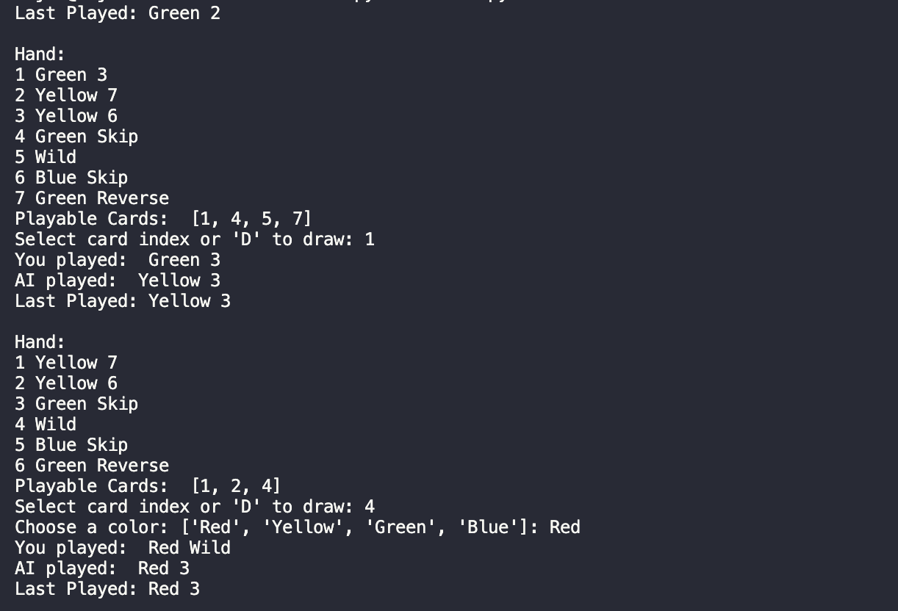

# UNO Game

A modular, object-oriented implementation of the UNO card game built in **Python** as part of **CS333 – Testing & DevOps** coursework.  
This project demonstrates structured design, automated testing, and continuous integration principles.

This command-line version of UNO models the core mechanics of the game — drawing, playing, and matching cards by color or value — along with special actions such as **Skip**, **Reverse**, **Draw Two**, **Wild**, and **Wild Draw Four**.

The codebase emphasizes:
- Clear class design for each game component  
- Test coverage using `pytest` and `coverage`  
- Automation aligned with DevOps best practices  

---

## Technical Summary

Developed using object-oriented design principles with separate modules for cards, deck management, players, and game logic.  
Includes automated testing through `pytest` and coverage reporting to ensure functional reliability and maintainability.

---

## Running the Game

```bash
python main.py
```

---

## Example Gameplay

<p align="center">
  
  <br>
  <em>Figure 1: Sample UNO gameplay in the terminal.</em>
</p>

---

## Coverage Report

<p align="center">
  
  <br>
  <em>Figure 2: Test coverage report generated using pytest-coverage.</em>
</p>


---
_Developed by Rajat Sharma for CS333 – Testing & DevOps, University of Nevada, Reno._

